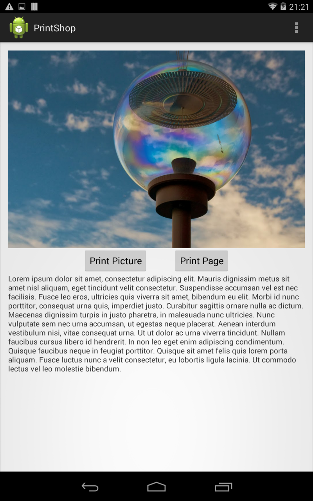
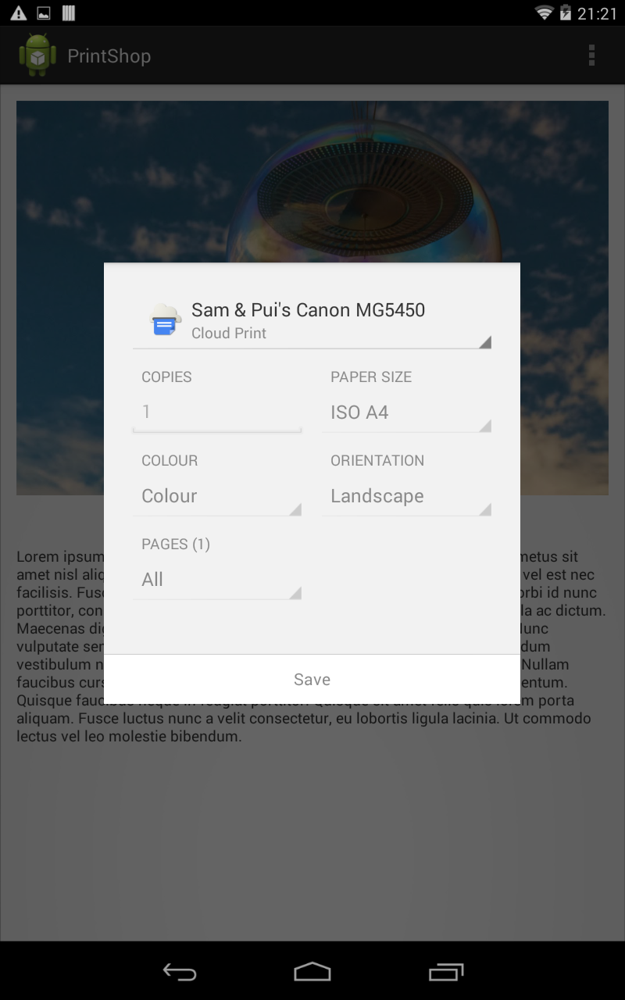
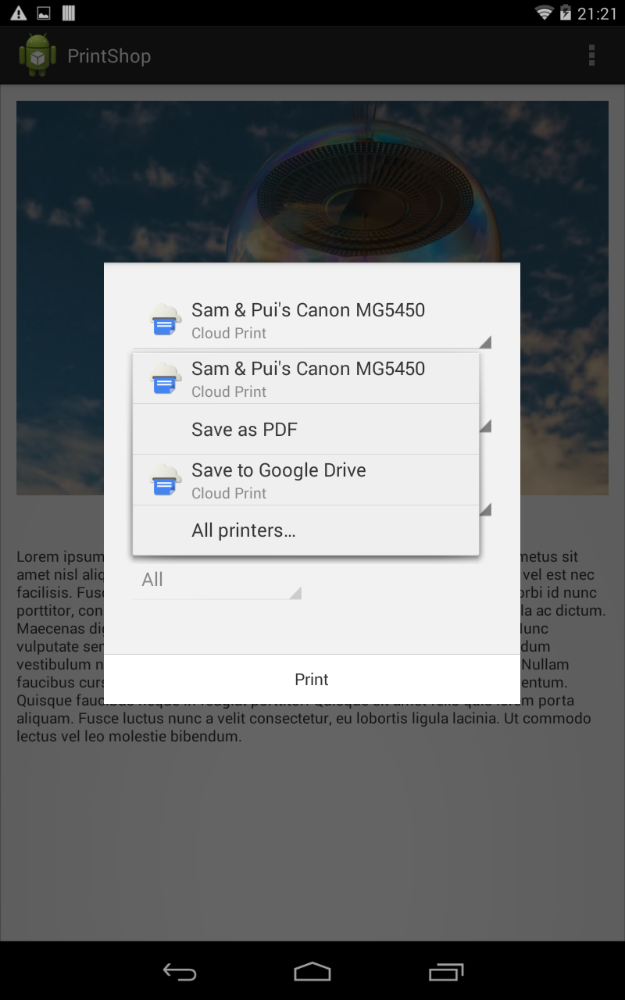
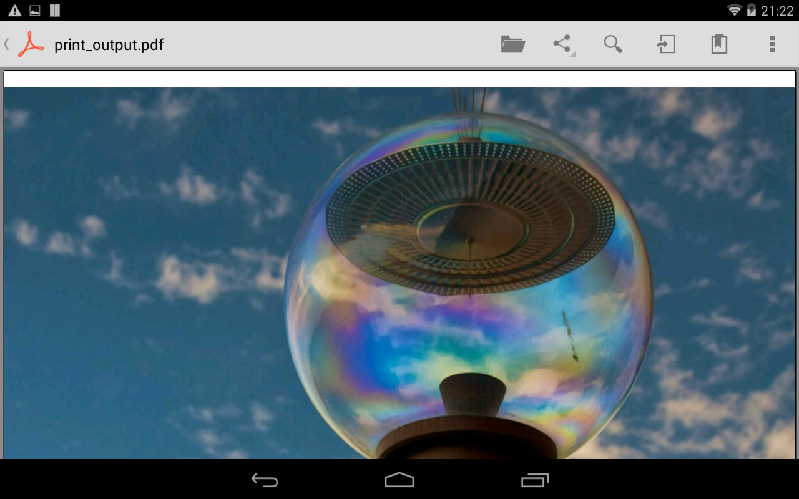
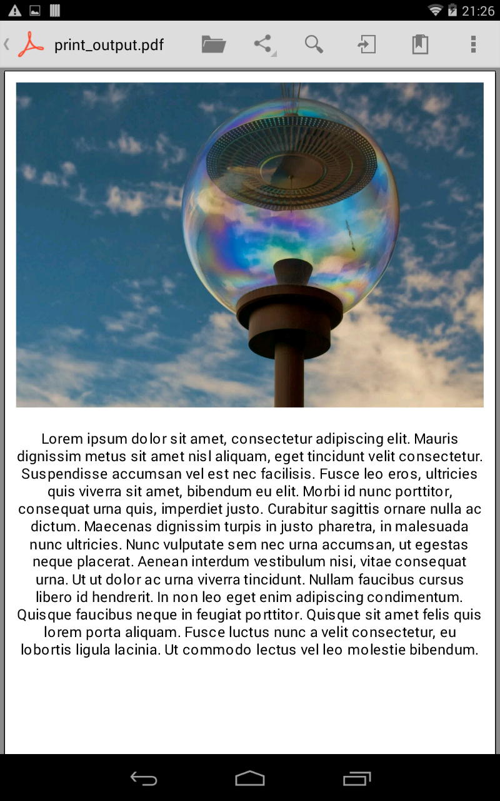
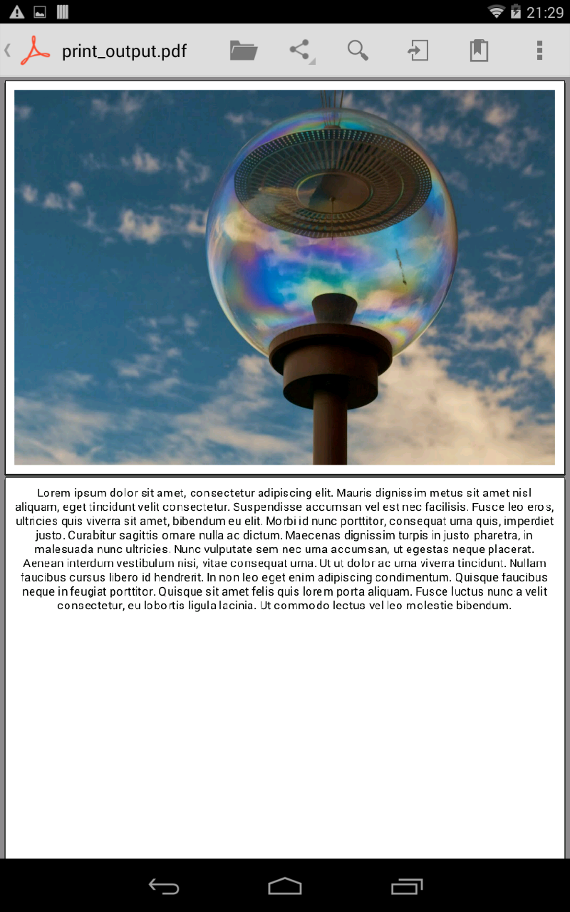

# Android KitKat: finger-by-finger 

## Using the new Android Printing Framework

One of the new frameworks present in KitKat is a full-stack printing framework,
which allows app developers to hand off the printing of a variety of content.
The framework supports all kinds of printers - from wifi and bluetooth, though
to internet-enabled printers via Google CloudPrint. Part of the new framework
allows providers to integrate their printing services with the framework, allowing
users to choose a suitable printer at runtime. The framework provides developers
with the ability to create content to send to the print service, with helper
methods for imagery, and a full API for creating custom content.

In this article we'll take a look at how to create content to provide to the
print service - at how to add printing capabilities to your KitKat-enabled app.

There is an accompanying demo app with complete source code available on GitHub - 
at GITHUB_LINK_HERE. It was written and tested in AndroidStudio 0.4.4, so you
should be able to get it running as a gradle project in either AndroidStudio or
Eclipse.

The sample project comprises of a single activity and fragment, which contains
an image and some accompanying text. There are 2 buttons, each triggering a print
operation, using the two techniques we're going to explore in this post.

### Printing Images

The print framework provides an easy-to-use helper API for printing images - i.e.
photos for a photo printer or the suchlike. The Android support library includes
a `PrintHelper` class which enables the printing of images. The following code
snippet (attached to a button's `onClickListener`) demonstrates how to use it:

    PrintHelper printHelper = new PrintHelper(getActivity());
    printHelper.setScaleMode(PrintHelper.SCALE_MODE_FIT);
    // Get the image
    Bitmap image = getImage();
    if (image != null) {
        // Send it to the print helper
        printHelper.printBitmap("PrintShop", image);
    }

Creating a `PrintHelper` requires a `Context` object, and since we're calling it
from inside a fragment, we provide the `Context` via `getActivity()`. A
`PrintHelper` has 3 important properties - `ScaleMode`, `ColorMode` and
`Orientation`. The former describes how the image should be resized to fit the
print page output, `ColorMode` determines whether the picture should print in
full color, or in monochrome, and `Orientation` specifies whether the image should
be printed in portrait or landscape.

The `getImage()` method is a utility method for obtaining the image from the
fragment, which we'll take a look at below. Provided we have a `Bitmap` then
the `printBitmap` method is called on the `PrintHelper` object, passing in a
`String` for the name of the job, and the `Bitmap` we wish to print.

The `getBitmap()` method is as follows:

    public Bitmap getImage() {
        ImageView imageView = (ImageView) getView().findViewById(R.id.imageView);
        Bitmap image = null;
        // Get the image
        if ((imageView.getDrawable()) != null) {
            // Send it to the print helper
            image = ((BitmapDrawable) imageView.getDrawable()).getBitmap();
        }
        return image;
    }

This finds the `ImageView` with the specified name, and then extracts a bitmap
from it. This is returned so that it can be set to the `PrintHelper`.

Once `printBitmap` has been called, then the system will present a print dialog
to the user, allowing the details of the print job to be specified. These include
the number of copies, the page ranges, paper size and orientation:

The new print framework in KitKat also provides a method of adding support for
print devices, but even without this, the system provides support for saving a
PDF, printing to Google Drive and Google Cloud Print devices:

Selecting "Save as PDF" will create a PDF containing the photo, with the specified
page size:

### Custom Print Adapter

Using the `PrintHelper` is all well and good for printing simple images, but
for more complicated content we have to create a custom print adapter, which
specifies exactly how the print content should be laid out.

`PrintDocumentAdapter` is an abstract class which, via subclassing, can be used
to layout a page for printing. It has 4 methods which can be overridden, describing
the workflow associated with the printing process:

- `onStart()` -- This is called once at the beginning of a new print job. It can be
used to create resources and objects required for the lifetime of the job - for
example you might have a layout managed which you would instantiate at this point.
- `onLayout()` -- Called at least once with the details of the print job - e.g.
page size, orientation. As the user changes these settings via the print dialog
additional calls will be made to this method to allow updates in the layout. You
must provide notification that the layout is complete via the provided callback
object.
- `onWrite()` -- __Might__ be called, following a call to `onLayout()`. This signals
a request to write a PDF of the specified pages to a given output location. In a
similar way to `onLayout()`, you must provide notification that this method is
complete via the callback object.
- `onFinish()` -- Always called once at the end of a job to allow cleanup of
resources you may have created during the job.

In the simple example provided in __PrintShop__, we actually only need to override
2 of these methods - `onLayout()` and `onWrite()`, which we'll take a look at
after we've taken a look at the constructor.

#### Creating a custom print adapter

The simple adapter we'll build today will be able to print any object which contains
an image and some text. In order to describe such objects we'll create a interface:
`imageAndTextContainer`:

    public interface ImageAndTextContainer {
        public String getText();
        public Bitmap getImage();
    }

Very simple interface which defines a way of obtaining a `Bitmap` for an image and
a `String` of text. When we create a print document adapter, we'll require one of
these containers, as well as a `Context` object:

    public class PrintShopPrintDocumentAdapter extends PrintDocumentAdapter {

        private ImageAndTextContainer imageAndTextContainer;
        private Context context;
        private int pageCount;
        private PrintedPdfDocument pdfDocument;

        public PrintShopPrintDocumentAdapter(ImageAndTextContainer container, Context cxt) {
            imageAndTextContainer = container;
            context = cxt;
        }
    }

We save these arguments off into member variables for now. You'll see how the other
two member variables are used later on, as we work through the page layout and
writing operations.

Since we want to print the fragment we've already seen, we need to ensure that it
implements this new `ImageAndTextContainer` interface:

    public class PrintDemoFragment extends Fragment implements ImageAndTextContainer {

        ...

        @Override
        public String getText() {
            TextView textView = (TextView) getView().findViewById(R.id.textView);
            return textView.getText().toString();
        }

        @Override
        public Bitmap getImage() {
            ImageView imageView = (ImageView) getView().findViewById(R.id.imageView);
            Bitmap image = null;
            // Get the image
            if ((imageView.getDrawable()) != null) {
                // Send it to the print helper
                image = ((BitmapDrawable) imageView.getDrawable()).getBitmap();
            }
            return image;
        }
    }

We've actually already created the `getImage()` method for the previous photo
printing section, so actually all we've added is the `getText()` method, which
in this simple example just grabs the content of the `TextView`.

Now that we've created the print adapter, we need to prepare the page layout, and
write the completed print document to the print manager.

#### Laying out the pages

The `onLayout()` method is likely to be called multiple times, as the user configures
their print settings. Therefore it should be a fairly cheap operation. The result
of this call should provide a `PrintDocumentInfo` object, which contains information
such as the number of pages in the document.

Let's take a look at the completed method and then work though the constituent parts:

    @Override
    public void onLayout(PrintAttributes oldAttributes, PrintAttributes newAttributes, CancellationSignal cancellationSignal, final LayoutResultCallback callback, Bundle extras) {

        // Register a cancellation listener
        cancellationSignal.setOnCancelListener(new CancellationSignal.OnCancelListener() {
            @Override
            public void onCancel() {
                callback.onLayoutCancelled();
            }
        });

        // Prepare the layout.
        int newPageCount;
        if(newAttributes.getMediaSize().getHeightMils() < 1000) {
            newPageCount = 2;
        } else {
            newPageCount = 1;
        }

        // Create the PDF document we'll use later
        pdfDocument = new PrintedPdfDocument(context, newAttributes);

        // Has the layout actually changed?
        boolean layoutChanged = newPageCount != pageCount;
        pageCount = newPageCount;

        // Create the doc info to return
        PrintDocumentInfo info = new PrintDocumentInfo
                .Builder("print_output.pdf")
                .setContentType(PrintDocumentInfo.CONTENT_TYPE_DOCUMENT)
                .setPageCount(pageCount)
                .build();

        // Not actually going to do anything for now
        callback.onLayoutFinished(info, layoutChanged);
    }

The first thing to do as part of `onLayout()` is to register a cancellation listener,
so that if the user chooses to cancel the print, then the layout process will
cancel. This is made possible since the `onLayout()` method is passed a
`CancellationSignal` object, which we can register a `OnCancelListener` to. Here
we'll just callback that we've canceled the layout process. In practice you can
use this as an opportunity to tidy up any expensive objects that you have around,
or indeed kill any worker threads that you've kicked off.

In order to demonstrate how the layout can change, we're calculating the number of
pages based on the size of the page the printer is going to use. Here we've got 
a really simple check based on the magic value of 8000Mils (note that 1 Mil =
1/1000 inch). 

`pdfDocument` is a member variable which will be used with the `onWrite()` method,
and we prepare it here, whilst we've been passed the context and the attributes.
From the point of view of the PrintAdapter, printing is actually just the
equivalent of creating a PDF and sending it to the printer. The print framework
deals with interacting with the different print drivers.

When the layout has been completed, the callback requires 2 arguments - a
`PrintDocumentInfo` object which contains information on how the document should
be constructed, and a boolean which specifies whether the layout has changed since
the last time `OnLayout` was called. Since our layout is very simple, the only
consideration for whether the layout has changed is the number of pages - so
we add a simple check for that.

To create the `PrintDocumentInfo` object, we use a `Builder`, setting the output
file name, the content type to be document (as opposed to photo), and the number
of pages to value we calculated.

We then call the `onLayoutFinished()` method on the callback object supplied as
an argument. It's likely that the `onLayout` method will be called multiple times
per print job - as the user configures the print job (e.g. changing paper size).

#### Writing the print job

Once the user is happy with the settings for a given job then they will tap the
print button, and that'll call `onWrite()` on the print adapter. 

We'll take a look at what this method does in small chunks:

    @Override
    public void onWrite(PageRange[] pages, ParcelFileDescriptor destination, CancellationSignal cancellationSignal, final WriteResultCallback callback) {

        // Register a cancellation listener
        cancellationSignal.setOnCancelListener(new CancellationSignal.OnCancelListener() {
            @Override
            public void onCancel() {
                // If cancelled then ensure that the PDF doc gets thrown away
                pdfDocument.close();
                pdfDocument = null;
                // And callback
                callback.onWriteCancelled();
            }
        });

        ...
    }

In the same way as we did with the `onLayout()` method, we register a cancellation
listener - which is an `OnCancelListener` object. This again means that should the
user cancel the print job, we can stop what we're doing and tidy up.

Next, we'll actually draw each of the pages of the print job, looping through
them one at a time:

    // Iterate through the pages
    for (int currentPageNumber = 0; currentPageNumber < pageCount; currentPageNumber++) {
        // Has this page been requested?
        if(!pageRangesContainPage(currentPageNumber, pages)) {
            // Skip this page
            continue;
        }

        // Start the current page
        PdfDocument.Page page = pdfDocument.startPage(currentPageNumber);

        // Get the canvas for this page
        Canvas canvas = page.getCanvas();

        // Draw on the page
        drawPage(currentPageNumber, canvas);

        // Finish the page
        pdfDocument.finishPage(page);
    }

The first argument to the `onWrite()` method is an array of `PageRange` objects.
This allows the user to specify exactly which pages they would like printed. In
order to determine whether the current page should be drawn, the following helper
method checks to see whether the given page number exists within an array of
page ranges:

    private boolean pageRangesContainPage(int pageNumber, PageRange[] ranges)
    {
        for(PageRange range : ranges) {
            if(pageNumber >= range.getStart() && pageNumber <= range.getEnd()) {
                return true;
            }
        }
        return false;
    }

The `PdfDocument` class was also added in KitKat, and provides an easy-to-use way
to build PDF documents. The document was created in the `onLayout()` method, and
here we create a new page with `startPage()`, get hold of its `Canvas` with
`getCanvas()`, before drawing on it (using the `drawPage()`) utility method. Once
the page has been completed, the page should be completed with `finishPage()`.

The difficult part of creating the PDF is actually hidden behind the `drawPage()`
method, which gives an idea of how it can be achieved:

    private void drawPage(int pageNumber, Canvas canvas) {
        if(pageCount == 1) {
            // We're putting everything on one page
            Rect imageRect = new Rect(10, 10, canvas.getWidth() - 10, canvas.getHeight() / 2 - 10);
            drawImage(imageAndTextContainer.getImage(), canvas, imageRect);
            Rect textRect = new Rect(10, canvas.getHeight() / 2 + 10, canvas.getWidth() - 10, canvas.getHeight() - 10);
            drawText(imageAndTextContainer.getText(), canvas, textRect);
        } else {
            // Same rect for image and text
            Rect contentRect = new Rect(10, 10, canvas.getWidth() - 10, canvas.getHeight() - 10);
            // Image on page 0, text on page 1
            if(pageNumber == 0) {
                drawImage(imageAndTextContainer.getImage(), canvas, contentRect);
            } else {
                drawText(imageAndTextContainer.getText(), canvas, contentRect);
            }
        }
    }

Most of the code in this method is determining how the image and text components
should actually be laid out. This is fine for this simple example - in reality
it's likely that you'd want to create a separate layout engine, and pass the
laying out and drawing of the document to that.

Once the frames of the individual components has been calculated, the following
helper methods are used to actually draw the content:

    private void drawText(String text, Canvas canvas, Rect rect) {
        TextPaint paint = new TextPaint();
        paint.setColor(Color.BLACK);

        StaticLayout sl = new StaticLayout(text, paint, (int)rect.width(), Layout.Alignment.ALIGN_CENTER, 1, 1, false);

        canvas.save();
        canvas.translate(rect.left, rect.top);
        sl.draw(canvas);
        canvas.restore();
    }

    private void drawImage(Bitmap image, Canvas canvas, Rect r) {
        canvas.drawBitmap(image, null, r, new Paint());
    }

Text rendering is performed using a `StaticLayout`, and image rendering using the
`drawBitmap()` method on `Canvas`.

The final part of the `onWrite()` method in our print adapter is to take the PDF
document we've created and attempt to write it to the print service:

    // Attempt to send the completed doc out
    try {
        pdfDocument.writeTo(new FileOutputStream(destination.getFileDescriptor()));
    } catch (IOException e) {
        callback.onWriteFailed(e.toString());
        return;
    } finally {
        pdfDocument.close();
        pdfDocument = null;
    }

    // The print is complete
    callback.onWriteFinished(pages);

The `destination` argument supplies the location that the PDF document should
be written to, and we simply use the `writeTo()` method to do this. Depending
on the outcome of this attempt we either callback `onWriteFailed()` or
`onWriteFinished()`.

### Using the custom print adapter

Now that we've created the print adapter, it's really easy to use it. As the
`onOnClick` callback for a button, we provide the following implementation:

    final ImageAndTextContainer imageAndTextContainer = this;
    rootView.findViewById(R.id.print_page_button).setOnClickListener(new View.OnClickListener() {
        @Override
        public void onClick(View v) {
            // Create a PrintDocumentAdapter
            PrintShopPrintDocumentAdapter adapter = new PrintShopPrintDocumentAdapter(imageAndTextContainer, getActivity());
            // Get the print manager from the context
            PrintManager printManager = (PrintManager)getActivity().getSystemService(Context.PRINT_SERVICE);
            // And print the document
            printManager.print("PrintShop", adapter, null);
        }
    });

Notice that we create the print document adapter, providing a reference to an
`imageAndTextContainer` (which we defined before), and a context within which
to render.

We then get hold of the current `PrintManager`, which is available through the
activity's `getSystemService()` method. We then create the print job using the
`print()` method, passing the name of the job and the print document adapter.
This will kick off the pint process and present a dialog to the user to allow
them to control it.

Due to the way in which we control the layout of this particular print job,
changing the paper size will change the number of pages printed:

### Conclusion

The new Android Printing Framework makes it really easy to add printing to your
apps - both for simple photo content, to more complex, multi-page custom layouts.
This article has taken a look at how you can add printing to apps, but there is
another side to the framework - adding support for devices so they can register
themselves with the printing framework. For more information, check out the
pages about `android.printservice` on [developer.android.com](http://developer.android.com/reference/android/printservice/package-summary.html).

The code for the accompanying project is available on GitHub as part of the
KitKat: finger-by-finger project. Go grab it and give it a try - let me know if
you have any comments or feedback - either in the comments section below, on
GitHub or on twitter [@iwantmyrealname](https://twitter.com/iwantmyrealname). 
